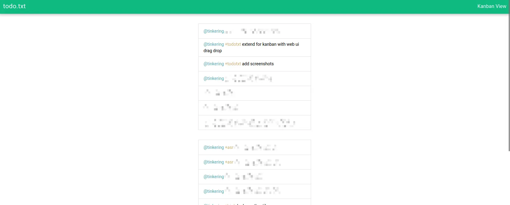
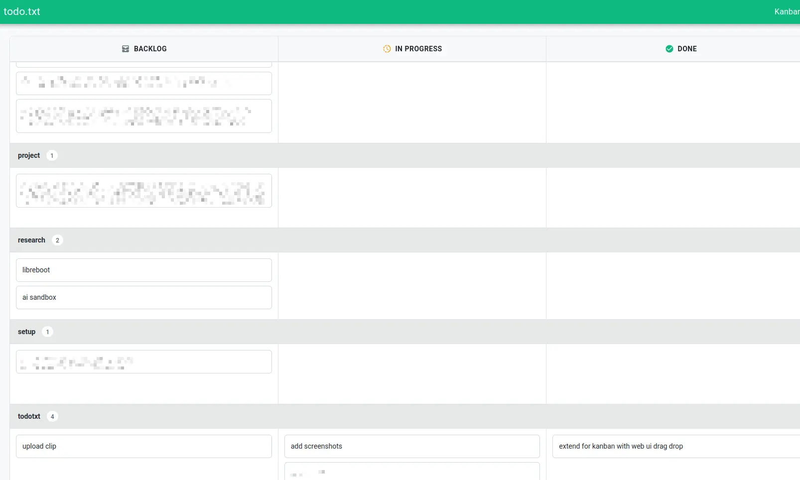

# todotxt

Web UI and API for todo.txt. Also has kanban view to triage tasks.

## Usage

ghcr docker image is available.

```bash
make build-frontend

docker build -t todotxt .
docker run \
  -p 3000:3000 \
  -v $(pwd)/todotxt:/opt/todotxt \
  -e TODO_PATH=/opt/todotxt/todo.txt \
  -e LISTEN_ADDR=:3000 \
  todotxt
```

## Screenshots




